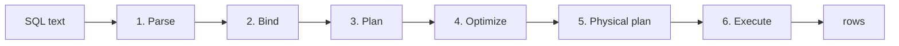

# 1. What is a query engine?

> After this chapter you will be able to name the six things that happen between typing a query and seeing rows, and point at the directory where each one lives.

## The question

We want the customers in the `BUILDING` segment with the largest order totals. Start with these two small tables, available as [customer.csv](../examples/customer.csv) and [orders.csv](../examples/orders.csv).

| C_CUSTKEY | C_NAME | C_MKTSEGMENT |
|---:|---|---|
| 1 | Alice | BUILDING |
| 2 | Bob | MACHINERY |
| 3 | Carol | BUILDING |

| O_ORDERKEY | O_CUSTKEY | O_TOTALPRICE |
|---:|---:|---:|
| 10 | 1 | 100 |
| 11 | 1 | 250 |
| 12 | 2 | 900 |
| 13 | 3 | 300 |

`C_CUSTKEY` identifies a customer; `O_CUSTKEY` says which customer placed an order. The join pairs rows with the same customer key. `WHERE` keeps the requested segment, `GROUP BY` collects each customer's rows, `SUM` adds the prices, and `ORDER BY ... DESC LIMIT 10` asks for up to ten results, largest first. This example groups by name for readability; a real application should group by the customer key too if names need not be unique.

```sql
SELECT c.C_NAME, SUM(o.O_TOTALPRICE) AS TOTAL
FROM CUSTOMER c JOIN ORDERS o ON c.C_CUSTKEY = o.O_CUSTKEY
WHERE c.C_MKTSEGMENT = 'BUILDING'
GROUP BY c.C_NAME
ORDER BY TOTAL DESC
LIMIT 10
```

And here is what this engine answers, on a tiny three-customer dataset:

```
+--------+-------+
| C_NAME | TOTAL |
+--------+-------+
| Alice  | 350   |
| Carol  | 300   |
+--------+-------+
2 row(s) returned.
```

You can check the answer by hand. Alice's two orders total 350; Carol's one order totals 300. Bob's order is larger, but his segment excludes him. Notice what the query leaves open: which table to read first, when to apply the filter, which join algorithm to use, and how much memory to spend.

SQL is a language in which you describe **what you want**, and something else decides **how to get it**. That something else is the query engine, and this book is about what it does with the enormous freedom you just handed it.

## Why the freedom matters

Take the same query and imagine executing it the most literal way possible — the way you would write it as a nested loop:

```
for each customer c:
    for each order o:
        if c.C_CUSTKEY == o.O_CUSTKEY:
            if c.C_MKTSEGMENT == 'BUILDING':
                accumulate
```

On the three customers and four orders above, that is twelve comparisons. Fine. But three rows is not where this query lives.

**TPC-H** is a standard benchmark: a fixed set of eight tables describing customers, orders, and parts, a fixed set of queries over them, and a *scale factor* that says how much data to generate. Database vendors publish TPC-H numbers, so the schema is the closest thing the field has to a shared example, and this book uses it for the same reason. It ships with the engine in [`src/catalog/tpch-schema.ts`](../../src/catalog/tpch-schema.ts).

At scale factor 1, `CUSTOMER` holds 150,000 rows and `ORDERS` holds 1,500,000. The nested loop above then does **225 billion key comparisons**. Roughly four fifths of the customers are outside the `BUILDING` segment. Filtering those customers first avoids about 180 billion comparisons; using a lookup table avoids most of the remaining pairwise search.

Two rearrangements fix most of it:

1. **Filter first.** Discard non-`BUILDING` customers before joining, not after. Same answer, one fifth of the rows entering the join.
2. **Hash instead of loop.** Build a lookup table on `C_CUSTKEY` once, then probe it once per order. That turns a multiplication into an addition — 150,000 + 1,500,000 instead of 150,000 × 1,500,000.

Neither change requires knowing the answer in advance. The optimizer can discover both from the query's structure, then use information about the data to choose between alternatives. You write the *what* once, and improvements to the engine can improve the *how* without changing your query.

## The six stages

A SQL `SELECT` follows six stages. Cached queries can reuse compilation work, and table-creation statements take a separate path. For a first read, follow the uncached query through [`compileUncached`](../../src/engine/query-engine.ts):

```typescript
const ast = this.parseSQL(sql);
// ... EXPLAIN and DDL statements branch off here
const bound = this.bind(targetAst, params);
const logicalPlan = this.plan(bound);
// ...
await this._ensureStatistics(referencedTables(logicalPlan, cteMap));
const optimized = this.optimize(logicalPlan);
```

Plus execution, which happens after compilation.



### 1. Parse — text to syntax

[`parse`](../../src/parser/parser.ts) turns the characters `SELECT c.C_NAME, ...` into a tree that mirrors the grammar of SQL: a select statement, with a list of projections, a from clause, a where clause. It answers *is this valid SQL?* and nothing else. It has never heard of a table called `CUSTOMER` and does not care whether one exists.

### 2. Bind — syntax to meaning

[`Binder`](../../src/binder/binder.ts) is where names become things. `c` becomes a reference to the `CUSTOMER` table. `C_NAME` becomes a specific column of a specific type. `SUM(o.O_TOTALPRICE)` becomes an aggregate function with a known return type. `SELECT *` is expanded into an actual column list.

This is the stage that produces the errors you actually see day to day: *no such column*, *ambiguous reference*, *cannot compare a string to a number*. The parser cannot produce those errors because it does not know what anything means.

### 3. Plan — meaning to relational algebra

[`createLogicalPlan`](../../src/planner/logical-planner.ts) discards the shape of SQL entirely and rebuilds the query as a tree of operations over tables. Run it on our query and it produces this:

```
-> Limit (count: 10)
  -> Project (C.C_NAME, SUM(O.O_TOTALPRICE))
    -> Sort (SUM(O.O_TOTALPRICE) DESC)
      -> Aggregate (group by: C.C_NAME) (aggs: SUM(O.O_TOTALPRICE))
        -> Filter (condition: (C.C_MKTSEGMENT = 'BUILDING'))
          -> Join (condition: (C.C_CUSTKEY = O.O_CUSTKEY))
            -> Seq Scan on CUSTOMER as C
            -> Seq Scan on ORDERS as O
```

Read the data flow bottom-up: scan both tables, join them, filter the result, group it, sort it, keep the requested columns, then take ten. On our data, the join produces four rows, the filter keeps three, and the aggregate produces the two totals above. This tree describes the operations; it does not yet choose a nested loop or a hash join. **The planner's first job is correctness.** Optimization and physical planning decide how to make that work efficient.

Two details worth noticing now, because they recur throughout the book. First, the tree is upside down relative to how you read SQL: `SELECT` is at the top but runs nearly last, and `FROM` is at the bottom but runs first. Second, the filter sits *above* the join, because that is where `WHERE` sits in the text.

### 4. Optimize — the same query, rearranged

The [`Optimizer`](../../src/optimizer/optimizer.ts) applies a sequence of rewrites, each one a small self-contained rule that takes a plan and returns a better plan meaning exactly the same thing. A rewrite like that is called a **pass**, and this engine ships 23 of them, registered by [`createDefaultOptimizer`](../../src/optimizer/optimizer-pipeline.ts). (The pipeline runs 24 of them, because one pass is useful enough to register twice; [chapter 15](../03-optimizer/15-passes-and-fixpoints.md) does the exact accounting, and [chapter 17](../03-optimizer/17-predicate-pushdown.md) says which pass repeats and why.)

On our query, three of them fire. `PredicatePushdown` slides the filter down past the join and onto the `CUSTOMER` scan. `LimitPushdown` moves the limit below the projection. `TopNFusion` notices a `Limit` sitting directly on a `Sort` and fuses them into a single `Top-N` operator, which can keep ten rows in a heap instead of sorting all of them. The result:

```
-> Project (C.C_NAME, SUM(O.O_TOTALPRICE))
  -> Top-N (count: 10, order: SUM(O.O_TOTALPRICE) DESC)
    -> Aggregate (group by: C.C_NAME) (aggs: SUM(O.O_TOTALPRICE))
      -> Join (condition: (C.C_CUSTKEY = O.O_CUSTKEY))
        -> Filter (condition: (C.C_MKTSEGMENT = 'BUILDING'))
          -> Seq Scan on CUSTOMER as C
        -> Seq Scan on ORDERS as O
```

The filter now guards the `CUSTOMER` scan directly. `Sort` and `Limit` have become one node. **Both trees must satisfy the same query semantics.** That includes preserving duplicates and null behavior, while allowing different choices among ties the query does not resolve. Part 3 examines the conditions that make each rewrite legal.

### 5. Physical plan — choosing algorithms

The logical plan says *join*. It does not say *how*. Hash join, merge join, and nested loop join all compute a join and have wildly different performance depending on input size, sortedness, and available memory. [`PhysicalPlanner`](../../src/execution/physical-planner.ts) makes that choice, along with which side of the join to build the hash table from, and which of four aggregation strategies to use.

For our query on three rows it picks:

```
Project
  TopN
    PerfectHashAggregate
      NestedLoopJoin(INNER, build=left)
        Filter
          TableScan
        TableScan
```

A nested loop join — the algorithm this chapter opened by pricing at 225 billion comparisons. On three customers it is the right call: building a hash table costs more than looping. The physical planner has consulted the statistics gathered in stage 4 and concluded the inputs are tiny. Feed it the full TPC-H tables and it picks a hash join instead. **The physical plan is a function of your data, not just your query**, which is why two databases with identical schemas can run the same SQL through entirely different machinery.

### 6. Execute — plan to rows

An [`ExecutionContext`](../../src/execution/execution-context.ts), built fresh for each run by [`QueryExecutor`](../../src/execution/query-executor.ts), turns the physical plan into running operators and pushes data through them. Data does not move one row at a time; it moves in [`DataChunk`](../../src/storage/chunk.ts) batches of 2048 rows held column by column. Chapter 31 is about why that number and that layout matter enough to organize an entire engine around.

## In the code

| Stage | Directory | Entry point |
|---|---|---|
| Parse | `src/parser/` | [`parse`](../../src/parser/parser.ts) |
| Bind | `src/binder/` | [`Binder`](../../src/binder/binder.ts) |
| Plan | `src/planner/` | [`createLogicalPlan`](../../src/planner/logical-planner.ts) |
| Optimize | `src/optimizer/` | [`Optimizer`](../../src/optimizer/optimizer.ts) |
| Physical plan | `src/execution/` | [`PhysicalPlanner`](../../src/execution/physical-planner.ts) |
| Execute | `src/execution/operators/` | [`QueryExecutor`](../../src/execution/query-executor.ts) |
| Storage | `src/storage/` | [`DataChunk`](../../src/storage/chunk.ts) |
| Statistics | `src/catalog/` | [`Catalog`](../../src/catalog/catalog.ts) |

Everything else in `src/` — parallelism, distribution, the DataFrame API — is a variation on these six stages, and each gets its own part later.

## Traps

**The plan tree describes data flow, not a complete execution schedule.** Children produce rows and parents consume them. Streaming operators can overlap: a root `Limit` can receive its first rows while a scan is still running. Read bottom-up to understand where values come from; chapter 30 explains scheduling and blocking operators.

**"Optimized" does not mean "optimal".** An engine may exhaustively search a restricted space for a small query, but it cannot do so for arbitrary queries. This optimizer combines rules, bounded searches, and estimates. Chapter 53 explains what to do when its estimates lead to a poor choice.

**Nested loop join is not always a bug.** Above, it was correct. Judging a plan requires knowing the data, which is exactly why the engine collects statistics before optimizing rather than after.

**"Same answer" is not "same rows" when there are ties.** `ORDER BY TOTAL DESC LIMIT 10` does not say which rows win when the tenth and eleventh have equal totals, so `Sort` + `Limit` and the fused `Top-N` may legitimately return different customers. Both are correct answers to the query as written. An optimizer preserves what the query specifies, not what one particular plan happened to do.

## Exercises

### Understand

With the three customers and four orders, how many rows remain after filtering customers, joining orders, and grouping by name?

### Practice

1. **Observe.** Run the query yourself. Build with `npm run build:ts`, save this as `first-query.mjs` in the repository root, and run `node first-query.mjs`. The checked-in equivalent is available through `npm run book:query`:

   ```javascript
   import { createEngine, registerTable } from './dist/index.js';

   const sql = `SELECT c.C_NAME, SUM(o.O_TOTALPRICE) AS TOTAL
     FROM CUSTOMER c JOIN ORDERS o ON c.C_CUSTKEY = o.O_CUSTKEY
     WHERE c.C_MKTSEGMENT = 'BUILDING'
     GROUP BY c.C_NAME ORDER BY TOTAL DESC LIMIT 10`;

   const engine = createEngine();
   registerTable(engine, 'CUSTOMER', [
     { C_CUSTKEY: 1, C_NAME: 'Alice', C_MKTSEGMENT: 'BUILDING' },
     { C_CUSTKEY: 2, C_NAME: 'Bob', C_MKTSEGMENT: 'MACHINERY' },
     { C_CUSTKEY: 3, C_NAME: 'Carol', C_MKTSEGMENT: 'BUILDING' },
   ]);
   registerTable(engine, 'ORDERS', [
     { O_ORDERKEY: 10, O_CUSTKEY: 1, O_TOTALPRICE: 100.0 },
     { O_ORDERKEY: 11, O_CUSTKEY: 1, O_TOTALPRICE: 250.0 },
     { O_ORDERKEY: 12, O_CUSTKEY: 2, O_TOTALPRICE: 900.0 },
     { O_ORDERKEY: 13, O_CUSTKEY: 3, O_TOTALPRICE: 300.0 },
   ]);

   try {
     console.log((await engine.run(sql)).rows);
     // Put the plan-inspection code from the following exercises here.
   } finally {
     await engine.close();
   }
   ```

   `engine.run` returns an object with `rows`, `columns`, and `rowKeys`; the bordered table above is how the command-line tool renders that same result, and [chapter 2](02-running-it-yourself.md) shows it in place.

2. **Observe.** Inside the `try` block, run `engine.run('EXPLAIN ' + sql)` and inspect its rows. Compare the logical shape with the example above and find the appended physical plan; exact operator choices can change.

3. **Observe.** Inside the same `try` block, print the *unoptimized* plan. The engine exposes each stage separately:

   ```javascript
   const { formatPlan } = await import('./dist/planner/plan-formatter.js');
   const raw = engine.plan(engine.bind(engine.parseSQL(sql)));
   console.log(formatPlan(raw));
   ```

   Compare it to the optimized version. Which nodes moved?

4. **Extend (optional).** Add a fourth customer in the `BUILDING` segment with 5,000 orders, then re-run `EXPLAIN`. Does the physical plan still say `NestedLoopJoin`?

5. **Observe.** Write down, before reading Part 1, what you think has to happen for `SELECT *` to work. What does the engine need to know, and when does it need to know it?

### Hints and expected observations

There are 2 customers, 3 joined order rows, and 2 groups. Bob's 900 is excluded before the totals are calculated.

## Recap

- A **query engine** compiles a declarative description of a result into a procedure that produces it. SQL says what; the engine decides how.
- A query's path has six stages: **parse**, **bind**, **plan**, **optimize**, **physical plan**, **execute**. The last stage runs the compiled work.
- The **logical plan** is a tree of relational operations, read bottom-up. It is built for correctness, not speed.
- The **optimizer** rewrites that tree into an equivalent one. A rewrite must preserve the query's semantics for every input satisfying its assumptions, including null, duplicate, and metadata constraints.
- The **physical plan** picks concrete algorithms, using **statistics** about your actual data. The same SQL over different data yields different machinery.
- Rows move through execution in **chunks** of 2048, stored column by column.

Next: [chapter 2](02-running-it-yourself.md) gets the engine running on your machine, with a REPL and a visualizer that shows each optimizer pass firing one at a time.
