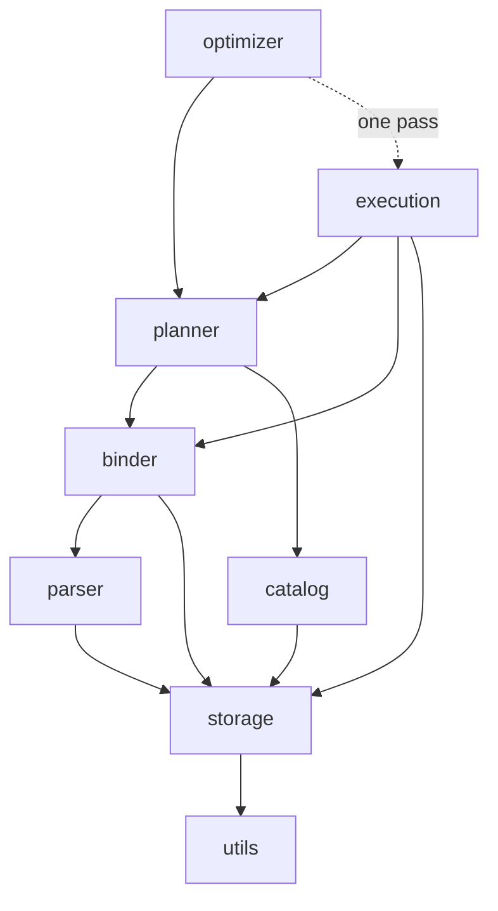

# 3. A map of the codebase

> After this chapter you will know which of the 238 source files matter for a given question, which way the dependencies point, and how to find the implementation of anything this book mentions.

## The question

`src/` holds 238 TypeScript files and about 39,500 lines. That is small for a database and large for an afternoon. Opening it cold, the honest reaction is: where does anything start?

The answer is that the directory layout is not arbitrary. Five directories carry the six compilation stages from chapter 1, in order — physical planning and execution share one — and two more hold what every stage sits on. Everything else is either a runtime service they use or an alternative front door onto the same machinery.

## The spine

Read these seven in this order and you have followed a query from text to rows:

```
src/parser/      SQL text        -> syntax tree
src/binder/      syntax tree     -> resolved names and types
src/planner/     resolved query  -> logical plan
src/optimizer/   logical plan    -> better logical plan
src/execution/   logical plan    -> physical plan -> rows
src/storage/     how bytes are laid out underneath all of it
src/catalog/     what tables exist and what the data looks like
```

`src/engine/query-engine.ts` sits above them and is the only file that touches all seven. It is 805 lines, and its [`compileUncached`](../../src/engine/query-engine.ts) method is the five-line spine quoted in chapter 1. **If you read one file before any other, read that one** — not for the details, but because it names every stage and shows the order.

## Where the complexity actually is

File counts lie; line counts lie less. Read the table below for its **proportions** rather than its digits — it was measured on one day against one commit, and the useful claim is "execution is roughly twice the optimizer", not any particular number.

| Directory | Files | Lines | What is in there |
|---|---:|---:|---|
| `execution/` | 50 | 10,485 | operators, physical planning, pipelines, expression evaluation |
| `optimizer/` | 42 | 5,427 | 23 passes, join ordering, decorrelation |
| `distributed/` | 27 | 4,859 | fragments, exchange, coordinator, transport |
| `storage/` | 30 | 2,842 | columns, chunks, encodings, pages, B-tree, spilling |
| `planner/` | 14 | 2,793 | logical plan nodes, cardinality, cost model |
| `parallel/` | 9 | 2,696 | worker threads and the scheduler that feeds them |
| `wasm/` | 20 | 2,076 | AssemblyScript kernels and their loader |
| `parser/` | 3 | 1,702 | lexer, parser, AST |
| `binder/` | 6 | 1,585 | scopes, type inference, expression binding |
| `cli/` | 10 | 1,320 | REPL and data loaders |
| `catalog/` | 8 | 1,156 | table metadata and statistics sketches |
| `dataframe/` | 7 | 1,102 | the lazy DataFrame API |
| `engine/` | 1 | 805 | the orchestrator |
| `utils/` | 5 | 376 | bitmap, bloom filter, hash, LRU, priority queue |

Two observations worth carrying into the rest of the book.

**Execution is a quarter of the engine.** This surprises people who expect the optimizer to dominate, because the optimizer is what gets written about. But an optimizer pass is a tree rewrite of a hundred lines, while a single operator has to handle nulls, spilling, every join type, vectorized and scalar paths, and parallel execution. [`hash-join.ts`](../../src/execution/operators/hash-join.ts) alone is 556 lines and chapter 34 spends a whole chapter on it.

**The parser is the smallest interesting thing here.** Three files, 1,702 lines, and it will not appear again after Part 1. Parsing SQL is a solved problem; deciding what to *do* with the parsed query is not. If you come from compilers, this is the inversion to expect — in a query engine the front end is the easy part.

## Which way the arrows point

The stages depend downward and, with four exceptions, only downward:



Every pass but one knows about the planner's node types and nothing about operators. The planner knows about bound expressions but nothing about how a filter is evaluated. Storage knows about none of them. That layering is what makes the pass architecture in Part 3 possible: a pass can be added, removed, or reordered without touching anything below it.

The four edges that break the pattern are worth naming, because a map that hides its exceptions is not a map:

| Edge | File | Why |
|---|---|---|
| `optimizer` → `execution` | [`aggregate-pushdown.ts`](../../src/optimizer/passes/aggregate-pushdown.ts) | it builds a physical plan for each alternative and compares their costs |
| `planner` → `execution` | [`plan-node-descriptor.ts`](../../src/planner/plan-node-descriptor.ts) | it describes both logical and physical nodes uniformly, so it imports the physical node types |
| `planner` → `distributed` | [`aggregate-decomposition.ts`](../../src/planner/aggregate-decomposition.ts) | type-only, for the partial/final aggregate split that chapter 47 uses |
| `utils` → `storage` | [`bloom-filter.ts`](../../src/utils/bloom-filter.ts) | type-only, for `ColumnValue` |

The bottom two are `import type`, which disappears at compile time and creates no runtime dependency. The other two are real, and the first is the interesting one. `AggregatePushdown` decides whether pushing an aggregate below a join is worth it by planning both shapes and costing them — it constructs a [`PhysicalPlanner`](../../src/execution/physical-planner.ts) and calls [`totalPhysicalCost`](../../src/execution/physical-plan.ts) on the result. So one pass out of 23 does reach up into execution, and it is a cost-based decision that needs the physical layer to answer at all. Chapter 24 comes back to it.

## Everything else

The remaining directories are not stages. They are alternatives and services.

**`src/dataframe/`** — a second front door, and one shared service. Instead of writing SQL you build a query with method calls, lazily, and it compiles to the same logical plan the SQL path produces. Chapter 50 covers it. The important structural fact is that it is a *peer* of the parser and binder, not a wrapper around them: both routes converge on `LogicalPlanNode` and share everything after that. The name undersells it, though — [`InMemoryRelation`](../../src/dataframe/in-memory-relation.ts) also lives here, and it is what turns rows into chunks for *both* routes, so `query-engine.ts` and `engine-entry.ts` import from this directory whether or not you ever touch the DataFrame API.

**`src/parallel/`** — worker threads and shared-memory arenas. It parallelizes single-machine execution by handing each thread a **morsel**, a small range of the input claimed from a shared counter rather than assigned in advance. Chapters 45 and 46.

**`src/distributed/`** — a separate concern from `parallel/`, despite the overlap in vocabulary. This one splits a plan into fragments that run on different *processes or machines*, connected by exchange operators over an HTTP transport. Chapters 47 through 49. That it is 4,859 lines — larger than the optimizer's pass collection — is a reasonable measure of how much distribution costs.

**`src/wasm/`** — AssemblyScript kernels for filters, arithmetic, and aggregates, plus the loader that instantiates them. Chapter 54 is honest about what fraction of execution actually reaches them.

**`src/cli/`** — the REPL from chapter 2 and the CSV and JSON loaders.

**`src/storage/backend/`** and **`src/runtime/platform.ts`** — the seam that lets the same core run in Node and in a browser. `platform.ts` is 29 lines and is the only file that reads environment variables. Chapter 44.

**`src/utils/`** — five data structures with no dependencies on anything above them: a bitmap, a Bloom filter, a hash function, an LRU cache, and a priority queue. When an operator needs one of these it imports from here rather than growing its own, which is why `hash-join.ts` and `hash-aggregate.ts` share a hash table implementation rather than two subtly different ones.

## Finding things

Three conventions make navigation predictable.

**`tests/` mirrors `src/` one-to-one.** `src/optimizer/passes/predicate-pushdown.ts` is tested by `tests/optimizer/passes/predicate-pushdown.test.ts`. There are 190 test files. When you want to know what a component is supposed to do, its test is usually a better answer than its implementation, because a test states intent and an implementation states mechanism.

**End-to-end tests live only in `tests/e2e/`.** Those run whole queries and compare results against a reference. Everything else is a unit test of one component.

**Names are literal.** An optimizer pass file is named after the pass class it exports, an operator file after the operator. There is no `misc/` and no grab-bag `common/` directory; the three catch-all files that do exist are each scoped to the directory they sit in — [`builder-utils.ts`](../../src/execution/builders/builder-utils.ts) for the operator builders, [`join-utils.ts`](../../src/execution/join-utils.ts) for the join operators, [`cli-common.ts`](../../src/cli/cli-common.ts) for the CLI entry points. So grepping for a concept usually finds the file directly.

Concretely, to answer "how does X work":

| You want | Look at |
|---|---|
| what an optimizer pass does | `tests/optimizer/passes/<pass>.test.ts` first, then the source |
| how an operator behaves on nulls or outer joins | `tests/execution/operators/<op>.test.ts` |
| what SQL is supported | [`src/parser/lexer.ts`](../../src/parser/lexer.ts) keyword list, then `tests/e2e/` |
| what a config knob does | [`src/config.ts`](../../src/config.ts) — every knob is one line with its default |
| the order passes run in | [`createDefaultOptimizer`](../../src/optimizer/optimizer-pipeline.ts) |

## In the code

| Landmark | File |
|---|---|
| The orchestrator | [`QueryEngine`](../../src/engine/query-engine.ts) |
| The one-page summary of the pipeline | [`compileUncached`](../../src/engine/query-engine.ts) |
| Every tunable constant | [`src/config.ts`](../../src/config.ts) |
| Pass order | [`createDefaultOptimizer`](../../src/optimizer/optimizer-pipeline.ts) |
| Logical node type union | [`src/planner/logical-plan.ts`](../../src/planner/logical-plan.ts) |
| Physical node types | [`src/execution/physical-plan.ts`](../../src/execution/physical-plan.ts) |
| Public API surface | [`src/index.ts`](../../src/index.ts) |

## Traps

**`src/parallel/` and `src/distributed/` are different systems.** Both talk about workers and partitions. The first uses threads inside one process and shared memory; the second uses separate processes and a network transport. A technique from one does not transfer to the other, and mixing up their vocabulary is the fastest way to misread Part 6.

**`src/execution/` contains both planning and execution.** The physical planner lives there, not in `src/planner/`, because choosing an algorithm requires knowing which algorithms exist. It is a defensible split, but it means "planning" happens in two directories.

**The line counts above will drift**, as the table's lead-in says. A chapter that cites one of them as a fact is citing a measurement, not an invariant.

## Exercises

1. Open [`query-engine.ts`](../../src/engine/query-engine.ts) and find `compileUncached`. Name the directory each of its five lines dispatches into.

2. Pick any file in `src/optimizer/passes/` and find its test. Read the test first and predict what the implementation must do, then check.

3. Run `grep -rn "execution/" src/planner src/optimizer` and confirm the only hits are the two files holding the runtime upward edges described above. Are they still there in your copy? Now read [`costOf`](../../src/optimizer/passes/aggregate-pushdown.ts) and decide whether that edge could be removed without losing the decision it makes.

4. Count the operators: `ls src/execution/operators/`. Match each one to a node type in [`physical-plan.ts`](../../src/execution/physical-plan.ts). Are there node types with no operator file, and if so, where are they handled?

5. Find the file that reads environment variables. There is exactly one. Why does centralizing that matter for the browser build?

## Recap

- Seven directories are the compilation pipeline, in order: **parser, binder, planner, optimizer, execution**, over **storage** and **catalog**.
- [`src/engine/query-engine.ts`](../../src/engine/query-engine.ts) is the only file that touches all of them, and is the right first read.
- **Execution is the largest subsystem**, roughly twice the optimizer. Parsing is the smallest interesting one.
- Dependencies point **downward**, with four documented exceptions, two of which are type-only. The one that matters is a single optimizer pass that costs alternatives by building physical plans for them.
- `parallel/` and `distributed/` are separate systems that share vocabulary and nothing else.
- `tests/` mirrors `src/` one-to-one, and a component's test is usually the clearest statement of what it is meant to do.

Next: [chapter 4](04-rows-columns-and-chunks.md) goes one level below all of this, to the data structure every operator in the engine actually manipulates.
