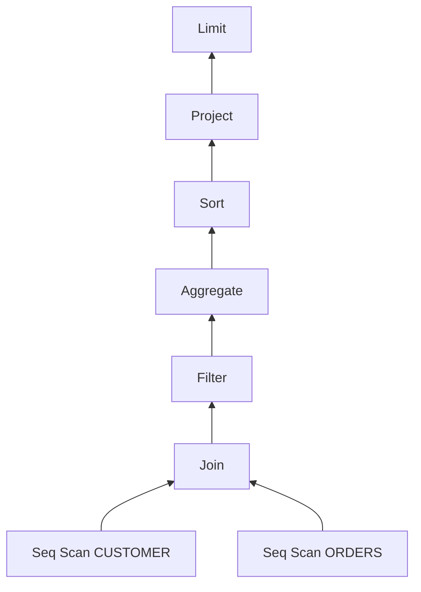

# 10. Relational algebra in twenty minutes

> After this chapter you will be able to read a simple plan using selection, projection, joins, and grouping, and explain the conditions for rearranging those operations.

## The question

Here is the same three-table query written two ways. The only difference is a pair of parentheses.

```sql
SELECT c.C_NAME, o.O_TOTALPRICE
FROM CUSTOMER c JOIN ORDERS o ON c.C_CUSTKEY = o.O_CUSTKEY
                JOIN CUSTOMER c2 ON c2.C_CUSTKEY = o.O_CUSTKEY
```

```sql
SELECT c.C_NAME, o.O_TOTALPRICE
FROM CUSTOMER c JOIN (ORDERS o JOIN CUSTOMER c2 ON c2.C_CUSTKEY = o.O_CUSTKEY)
                ON c.C_CUSTKEY = o.O_CUSTKEY
```

The planner takes them at their word and builds two different trees:

```
-> Project (C.C_NAME, O.O_TOTALPRICE)
  -> Join (condition: (C2.C_CUSTKEY = O.O_CUSTKEY))
    -> Join (condition: (C.C_CUSTKEY = O.O_CUSTKEY))
      -> Seq Scan on CUSTOMER as C
      -> Seq Scan on ORDERS as O
    -> Seq Scan on CUSTOMER as C2
```

```
-> Project (C.C_NAME, O.O_TOTALPRICE)
  -> Join (condition: (C.C_CUSTKEY = O.O_CUSTKEY))
    -> Seq Scan on CUSTOMER as C
    -> Join (condition: (C2.C_CUSTKEY = O.O_CUSTKEY))
      -> Seq Scan on ORDERS as O
      -> Seq Scan on CUSTOMER as C2
```

One is left-deep, one is right-deep. They read different tables first and build different intermediate results. And they return exactly the same rows:

```
J3 left-deep  -> [{"C_NAME":"Alice","O_TOTALPRICE":200},{"C_NAME":"Alice","O_TOTALPRICE":150},{"C_NAME":"Bob","O_TOTALPRICE":500},{"C_NAME":"Carol","O_TOTALPRICE":300}]
J3 right-deep -> [{"C_NAME":"Alice","O_TOTALPRICE":200},{"C_NAME":"Alice","O_TOTALPRICE":150},{"C_NAME":"Bob","O_TOTALPRICE":500},{"C_NAME":"Carol","O_TOTALPRICE":300}]
```

Something must license that substitution. It is not luck, and it is not a property of SQL — SQL is a surface syntax with `SELECT` at the top and `FROM` in the middle, and nothing about that shape tells you a join can be reassociated. The license comes from the fact that these trees are not trees of SQL. They are expressions in an algebra, and algebras have laws.

## Relations, and why closure matters

A **relation** is a bag of rows sharing one schema. Bag, not set: duplicates are ordinary and are not removed unless you ask.

```
bag -> [{"C_MKTSEGMENT":"BUILDING"},{"C_MKTSEGMENT":"MACHINERY"},{"C_MKTSEGMENT":"BUILDING"}]
set -> [{"C_MKTSEGMENT":"BUILDING"},{"C_MKTSEGMENT":"MACHINERY"}]
```

The first is `SELECT C_MKTSEGMENT FROM CUSTOMER`, the second adds `DISTINCT`. In the original relational algebra there is only the second, because a relation is a set. Every practical engine works in bags instead, because deduplicating after every operator is enormously expensive and almost never what anyone wanted. Deduplication becomes an operator you request, which is why this engine has a `Distinct` node at all.

The property that makes an algebra useful is **closure**: every operator takes relations and produces a relation. Nothing else. A filter over a table gives a relation; a filter over a join gives a relation; a filter over a filter over a join gives a relation. There is no operator that yields a number, a row, or a half-built thing that some other operator has to know how to finish.

Closure lets operators compose when their schemas and other requirements agree. A filter still needs its referenced columns to exist, for example. A tree is a convenient representation of that composition, but closure does not require one: an engine could use a graph with shared subexpressions or instructions naming intermediate results.

## Four operators

Four operators cover the large majority of what SQL asks for, and every plan in this book is built mostly from them.

### Selection (`Filter`)

Written **σ**. It keeps the rows that satisfy a predicate: schema unchanged, row count down.

```
-> Project (CUSTOMER.C_NAME)
  -> Filter (condition: (CUSTOMER.C_MKTSEGMENT = 'BUILDING'))
    -> Seq Scan on CUSTOMER as CUSTOMER
```

The confusing part of the name is historical. In the algebra, "select" means *choose rows*, which is the job of SQL's `WHERE`. SQL's `SELECT` keyword is the other operator entirely.

### Projection (`Project`)

Written **π**. It chooses and computes columns: row count unchanged, schema narrowed — or widened, since π can compute new columns rather than only drop existing ones.

```
-> Project (CUSTOMER.C_NAME)
  -> Seq Scan on CUSTOMER as CUSTOMER
```

In textbook algebra π also deduplicates, because relations are sets. Here it does not, for the reason above.

### Join (`Join`)

Written **⋈**. It pairs rows from two relations that satisfy a condition. Both schema and row count change, and the row count can go up.

```
-> Project (C.C_CUSTKEY, C.C_NAME, C.C_MKTSEGMENT, O.O_ORDERKEY, O.O_CUSTKEY, O.O_TOTALPRICE, O.O_ORDERDATE)
  -> Join (condition: (C.C_CUSTKEY = O.O_CUSTKEY))
    -> Seq Scan on CUSTOMER as C
    -> Seq Scan on ORDERS as O
```

A join is not primitive. It is a cross product followed by a selection, and you can watch the two definitions agree on three customers and four orders:

```
cross        -> [{"N":12}]
cross+filter -> [{"N":4}]
join         -> [{"N":4}]
```

Twelve pairs exist; four survive the condition; the join produces those four directly. The engine keeps ⋈ as its own operator precisely because it must never *build* the twelve — chapter 34 is about how a hash join gets to four without passing through twelve.

### Grouping and aggregation (`Aggregate`)

Written **γ**. It partitions rows by a key and collapses each partition to one row.

```
-> Project (CUSTOMER.C_MKTSEGMENT, COUNT_STAR())
  -> Aggregate (group by: CUSTOMER.C_MKTSEGMENT) (aggs: COUNT_STAR())
    -> Seq Scan on CUSTOMER as CUSTOMER
```

Grouping and aggregation extend the original relational operators. For an unordered input, a hash aggregate generally consumes all rows before emitting final groups. If the input is sorted by the grouping key, a streaming aggregate can finish one group as soon as the next key begins; chapter 36 covers both algorithms. The logical operator defines the groups, not their execution schedule.

Notice that the grouping key appears twice in the plan, once in the `Aggregate` and once in the `Project` above it. That is not redundancy. γ produces a relation whose columns are *keys plus aggregates*, and π then selects and orders those columns into the output the user asked for. Each operator does one thing, and the seam between them is a relation like any other.

## Why a tree

Given closure, a tree is the natural encoding: each node's single output is its parent's input.



Two habits are worth forming immediately.

**Read data flow bottom-up.** Data enters at the leaves and flows toward the root. `Limit` consumes rows produced by its child, but it can start doing so before that child finishes. A plan tree records dependencies; chapter 30 explains how streaming and blocking operators turn those dependencies into a schedule.

**The tree is upside down relative to SQL.** `SELECT` is the first word you write and nearly the last operator to run; `FROM` is in the middle of the text and is the bottom of the tree. Chapter 12 shows exactly how the planner performs that inversion.

A tree, rather than a general graph, also means each node has exactly one consumer. That is a real restriction — a common subexpression used twice cannot be shared — and this engine pays for it in one specific place: a CTE referenced twice becomes two `CTE Scan` nodes over one plan held off to the side, rather than one node with two parents. Chapter 11 shows where that side table lives.

## Equivalence laws make rewrites legal

Here is the payoff. The operators' semantics let us establish when different expressions denote the same result. The laws below use **inner joins**, deterministic predicates, and compatible schemas; join conditions must follow the columns they reference. They preserve bags of rows, not an unspecified presentation order. Outer joins, volatile expressions, and operators with observable errors require additional care. Cost estimates then help decide which legal alternative to choose.

| Law | Informally | Where the book uses it |
|---|---|---|
| σ<sub>p</sub>(σ<sub>q</sub>(R)) = σ<sub>p∧q</sub>(R) | stacked filters merge | [chapter 17](../03-optimizer/17-predicate-pushdown.md) |
| σ<sub>p</sub>(R ⋈ S) = σ<sub>p</sub>(R) ⋈ S, when p mentions only R | filters move below joins | [chapter 17](../03-optimizer/17-predicate-pushdown.md) |
| R ⋈ S = S ⋈ R | joins commute | chapter 25 |
| (R ⋈ S) ⋈ T = R ⋈ (S ⋈ T) | joins reassociate | chapter 25 |
| π<sub>a</sub>(σ<sub>p</sub>(R)) = σ<sub>p</sub>(π<sub>a</sub>(R)), when p's columns survive a | projections and filters commute | chapter 19 |
| R ⋈<sub>p</sub> S = σ<sub>p</sub>(R × S) | a join is a filtered cross product | chapter 25 |

Associativity relates the two parenthesizations from the opening; commutativity allows the two inputs of an inner join to exchange places, with output columns kept in the requested order. These are not unrestricted laws for outer joins. `A LEFT JOIN B` preserves every row of A; `B LEFT JOIN A` preserves every row of B and can produce a different answer. Chapter 25 derives the additional conditions for reordering outer joins. You can watch inner-join commutativity and filter pushdown together in this plan:

```
-> Project (C.C_MKTSEGMENT, SUM(O.O_TOTALPRICE))
  -> Top-N (count: 5, order: SUM(O.O_TOTALPRICE) DESC)
    -> Filter (condition: (SUM(O.O_TOTALPRICE) > 200))
      -> Aggregate (group by: C.C_MKTSEGMENT) (aggs: SUM(O.O_TOTALPRICE))
        -> Join (condition: (C.C_CUSTKEY = O.O_CUSTKEY))
          -> Filter (condition: (O.O_TOTALPRICE > 100))
            -> Seq Scan on ORDERS as O
          -> Seq Scan on CUSTOMER as C
```

The filter has moved below the join (law 2), the join's inputs have swapped (law 3), and a `Sort` and a `Limit` have fused into `Top-N`.

The swap is the one to watch, because it is not decided by shape. Laws say the optimizer *may* exchange the inputs; whether it *does* is a cost decision, made on whatever row-count estimates it holds at that moment. Run the query once before optimizing it again and the estimates change, and so does the side `ORDERS` lands on. That is chapter 24's subject, and it is the reason a plan printed from a freshly started engine is the one to compare against.

An intermediate representation makes these conditions easier to express and check. SQL also has semantics and equivalent formulations, but moving text without resolving names, join types, and scope can change the answer. Chapter 17 shows why relocating a condition from `WHERE` to `ON` needs that information.

## Where the analogy stops

The algebra is four operators. This engine's plan has twenty-three node types, and the extra nineteen exist because SQL asks for things the algebra does not model.

**Order.** A bag has no order, but `ORDER BY` does, so there is a `Sort` node whose output is a sequence rather than a bag. Everything above a `Sort` has to preserve that sequence, which is why `Limit` and `Top-N` behave differently from a filter.

**Position.** `LIMIT` selects rows by position, which no bag-based operator can express.

**Deduplication.** `Distinct` is the bag-to-set conversion made explicit.

**Everything else.** Window functions, set operations, CTEs, index scans, and the operators the distributed layer inserts are all extensions layered on the same closure property: each still takes relations and returns a relation, which is why they compose with the four.

That closure is the load-bearing part. The extra nineteen node types make the IR expressive; the four operators and their laws make it *rewritable*. Chapter 11 is the full inventory.

## In the code

| Idea | Where |
|---|---|
| Node type inventory | [`PlanNodeType`](../../src/planner/logical-plan.ts) |
| Selection | [`LogicalFilter`](../../src/planner/logical-plan.ts) |
| Projection | [`LogicalProject`](../../src/planner/logical-plan.ts) |
| Join | [`LogicalJoin`](../../src/planner/logical-plan.ts) |
| Grouping | [`LogicalAggregate`](../../src/planner/logical-plan.ts) |
| Bag-to-set | [`LogicalDistinct`](../../src/planner/logical-plan.ts) |
| Tree walking | [`getChildren`](../../src/planner/logical-plan.ts) |
| A law, implemented | [`pushIntoJoin`](../../src/optimizer/passes/predicate-pushdown.ts) |

## Traps

**"Selection" means rows, "projection" means columns.** The algebra's σ is SQL's `WHERE`; SQL's `SELECT` is π. The vocabulary collides with SQL's exactly where it hurts most, and both terms are used in their algebraic sense throughout this book.

**Relations are bags here, not sets.** Every law above still holds in bag semantics, but a law half-remembered from a set-based textbook may not. π does not deduplicate, `UNION ALL` keeps duplicates, and `COUNT(C_MKTSEGMENT)` over the three customers above returns `3`, not `2`.

**A cross product is a join with no condition, not a different operator.** `SELECT * FROM CUSTOMER c, ORDERS o` produces a `CROSS Join` node, and the moment a predicate lands on it the optimizer relabels it `INNER`. The distinction is bookkeeping, not algebra.

**Equivalence is about every possible database, not yours.** A rewrite that happens to give the same answer on a three-row table is not a law. This is why some passes look overcautious — chapter 17's null-rejection check is the canonical example.

## Recap

- A **relation** is a bag of rows with a schema. SQL works in bags, not sets, so duplicates survive until a `Distinct` removes them.
- **Closure** lets relational operators compose when their input requirements agree. This engine represents that composition primarily as a **tree**.
- Four operators carry most of SQL: **selection** (σ, `Filter`), **projection** (π, `Project`), **join** (⋈, `Join`), and **grouping** (γ, `Aggregate`). A join is a cross product plus a selection, kept separate so the cross product need never be built.
- Plans are read **bottom-up** and are upside down relative to SQL: `FROM` is at the leaves, `SELECT` near the root.
- **Equivalence laws** identify legal rewrites. Inner joins commute and reassociate under the stated conditions; outer joins need additional rules. The optimizer combines these laws with estimates and search.
- The engine's algebra is larger than the textbook's, because SQL wants **order**, **position**, and **deduplication**, none of which a bag has.

Next: chapter 11 takes the inventory — [all twenty-three node types](11-the-logical-plan-nodes.md), and which stage of the pipeline produces each one.
